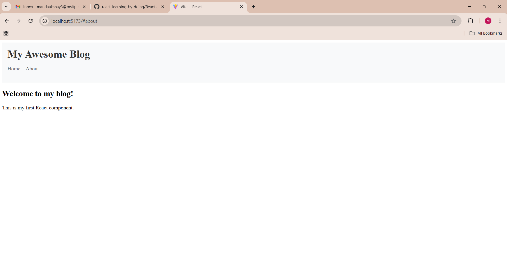
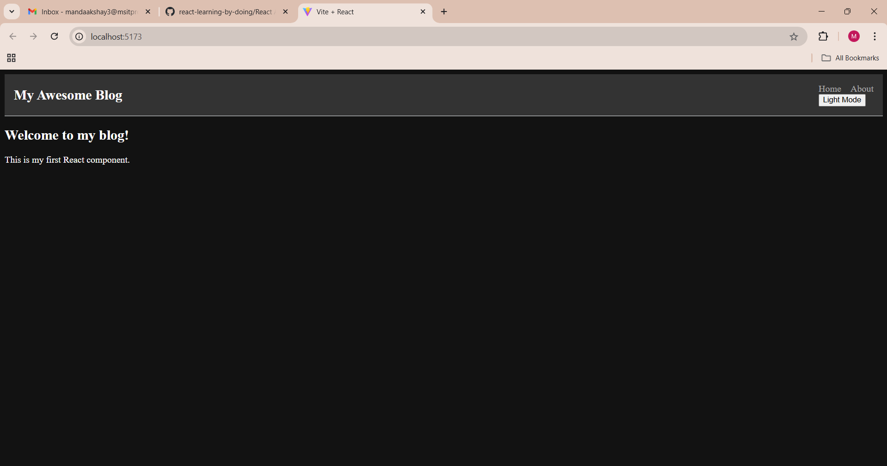

# my-blog

Project description

"My-Blog" is a personal blogging platform where users can create, edit, and publish posts. This project is built using React with Vite as the build tool, providing a fast and optimized development environment. 

Setup instructions:

1. Check Your Development Environment
First, ensure you have the necessary tools installed. Open your terminal and run:

node --version  # Should be 14.0.0 or higher
npm --version   # Should be 6.0.0 or higher
2. Create Your Project
# Create a new project
npm create vite@latest my-blog -- --template react

# Navigate to project folder
cd my-blog

# Install dependencies
npm install

# Start development server
npm run dev
3. Understanding Project Structure
Your project will have this structure:

my-blog/
├── node_modules/     # Dependencies (don't modify)
├── public/          # Static files
├── src/             # Your source code
│   ├── App.jsx      # Main application component
│   ├── main.jsx     # Application entry point
│   └── index.css    # Global styles
├── package.json     # Project configuration
└── vite.config.js   # Vite configuration

Screenshot of running application

png file ()

png file ()