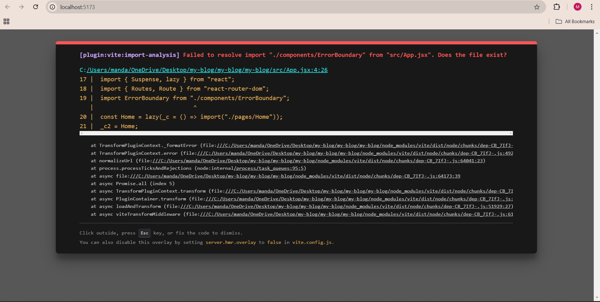

# my-blog

Project description

"My-Blog" is a personal blogging platform where users can create, edit, and publish posts. This project is built using React with Vite as the build tool, providing a fast and optimized development environment. 

Setup instructions:

1. Check Your Development Environment
First, ensure you have the necessary tools installed. Open your terminal and run:

node --version  # Should be 14.0.0 or higher
npm --version   # Should be 6.0.0 or higher
2. Create Your Project
# Create a new project
npm create vite@latest my-blog -- --template react

# Navigate to project folder
cd my-blog

# Install dependencies
npm install

# Start development server
npm run dev
3. Understanding Project Structure
Your project will have this structure:

my-blog/
├── node_modules/     # Dependencies (don't modify)
├── public/          # Static files
├── src/             # Your source code
│   ├── App.jsx      # Main application component
│   ├── main.jsx     # Application entry point
│   └── index.css    # Global styles
├── package.json     # Project configuration
└── vite.config.js   # Vite configuration

Screenshot of running application

png file ()

png file ()

------------------------------------------------------------------------------------------------

## Components Structure
- BlogPost: Individual blog post display
- BlogList: Container for multiple posts
- Header: Navigation and site title

## Styling Approach
For this assignment, I used CSS Modules to style the components. The key reasons for this approach are:

Scoped Styles: CSS Modules automatically scope styles to the components, meaning that each component has its own isolated style. This avoids potential conflicts with global CSS and ensures that the styles are only applied to their intended elements.

Maintainability: As the project grows, CSS Modules make it easier to manage and maintain styles because they keep the styles closely tied to their components, which makes it clear where the styles are applied. The naming convention in CSS Modules automatically generates unique class names to avoid name collisions.

Responsive Design: I implemented a responsive design for the BlogPost component using media queries, ensuring that the blog posts are well-presented on different screen sizes, such as mobile devices.

Component-Based Approach: Using CSS Modules in a component-based architecture ensures that styles are encapsulated in each component, making the design easy to tweak without affecting other parts of the application.

## New Features
In this assignment, the following features were added:

BlogPost Component:

This component displays an individual blog post with a title, content, author, date, and read time. It was built to display each post with appropriate styling and to be reusable across different parts of the application.
BlogList Component:

The BlogList component was created to render multiple BlogPost components by mapping over an array of posts and passing the necessary props. This enables the dynamic rendering of blog posts from a data source, making the application scalable.
Responsive Design:

The BlogPost component was designed to be responsive. I used media queries to adjust the layout on smaller screens, ensuring the content remains accessible and well-formatted on mobile devices.
CSS Modules Implementation:

The original CSS file (BlogPost.css) was renamed to BlogPost.module.css, and I updated the components to use the styles object imported from the CSS module. This method ensures scoped and modular styling, reducing the chances of styles leaking into other parts of the application.
Sample Blog Data:

I added sample blog data in src/data/posts.js to simulate real content being passed into the components. This sample data is used to populate the BlogList component.
App Component Update:

The App.jsx file was updated to include the Header and BlogList components, where the list of blog posts is passed as a prop, enabling dynamic rendering of content.

## Screenshots
[Add desktop and mobile screenshots]

Desktop view - ()
Mobile view - ()

................................................................................................................

Testing Scenarios

Like button:

Single click behavior
Multiple clicks
Visual feedback

Comments:

Empty comment validation
Long comment display
Timestamp formatting

Read More:

Short content behavior
Long content truncation
Toggle functionality

Testing image - ()

.............................................................................................................

Assignment - 3

Nothing has changed in Assignment -3. 
It will show as it is in Assignment - 2.

.............................................................................................................

Assignment - 4

After adding all the given files and updating the BlogList.jsx file it will show blank page.

................................................................................................................

Assignment - 5

After adding all the given files and updating the given files it will show blank page.

................................................................................................................

Assignment - 6

Created all the hook files 

................................................................................................................

Assignment - 7

Created all the given context files

................................................................................................................

Assignment - 8

Created all the given files and imported necessary module.

................................................................................................................

Assignment - 9

I am experiencing an import resolution error when trying to use the ErrorBoundary component in App.jsx. The Vite development server reports that it cannot locate the component, resulting in a failure to compile and run the application.

This error indicates that Vite could not locate the ErrorBoundary component at the path specified in the App.jsx file. This could result from several possible issues, such as an incorrect path, missing file extension, case sensitivity mismatch, or Vite caching.

Errors - 